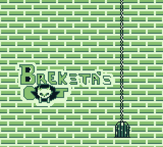
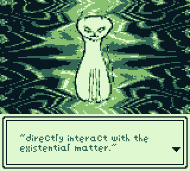
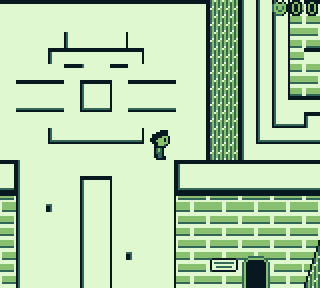
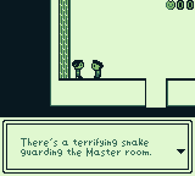
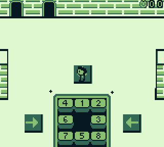
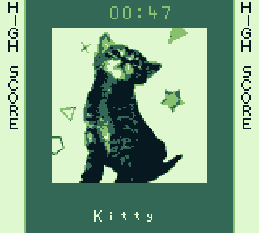
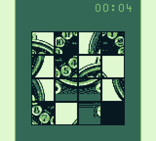
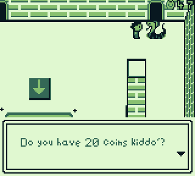
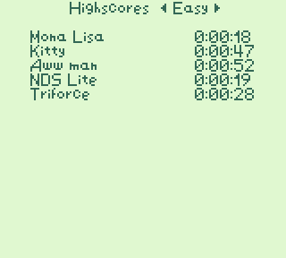

# Breksta's Cat

_Don't be like me. Plan things ahead until the very last detail. This ROM is a result of disobeying the golden rule of planning._

This repo is part of [HomebrewOwl.GB](https://github.com/NotImplementedLife/HomebrewOwl.GB "HomebrewOwl") projects collection.
This is a [GB Compo 2021](https://gbdev.io/gbcompo21/) game entry. Download the latest version [here](https://github.com/NotImplementedLife/brekstascat/releases/download/1.3/brekstascat_1_3.gb).

## The idea

Making my own scroll RPG game had been kind of a distant dream to me for a couple of years. 
Now that I feel I meet all the requirements to see my dream come true (knowledge, experience, and a small dose of creativity),
I finally made it. A simple Gameboy ROM which makes my dream come reality. Not much, honestly. There are only three small maps you can explore, but for my current self,
this feels like an incredible advancement.

I originally planned to make a scroll RPG like this for the Nintendo DS, but I wanted to spend more time on Gameboy programming to
familiarize more with the concept. Moreover, the GBCompo21 proved to be a valuable source of fun and motivation for working on this game.

Because the _map-scrolling_ is very naïve and limited due to its barebones implementation (just like I anticipated for my first strike), I wanted to insert something in my game to compensate with. Therefore, I chose another "genre" to be the Breksta's cat _actual_ specific. This is how it turned into a sliding-puzzle game, and consequently it is somehow thematically aligned with the Homebrew Owl's other two games: a [Rubik's cube](https://github.com/NotImplementedLife/rubik) and the board game [AIRPLANZ](https://github.com/NotImplementedLife/AIRPLANZ). The fact that the player can walk around a map and interact with things comes second and now represents just an optional feature - it's like the spawn room of a Minecraft adventure map where you read some signs and the press a button to teleport to the actual game.

In case I haven't mentioned it before, I'll say it now. I. Suck. At. Drawing. Things. Especially pixel art. I put all my heart and patience into creating what would would appear on an interested player's small Gameboy screen (or emulator). Every time I drew a new sprite/scene I was praying at least not to hurt my eyes when running the build. I hope it _looks good_ to all (if not, to the majority) of you.

However, despite of this obvious art and design drawback, I'm still proud to declare that Breksta's Cat is the most precious gem of my HomebrewOwl collection.
Here is a list of what it brings new in terms of Gameboy-related technical stuff (and not only):

- SRAM
- MBC memory handling
- Metasprites
- Variable Font Viewer implementation
- Lookup tables
- `r16` calls which made a script-like ROM reader possible (conveniently useful when I wanted to animate things during a dialog)
- Usage of Window
- RTC clock handling
- BCD
- Random (inspired from [here](https://wikiti.brandonw.net/index.php?title=Z80_Routines:Math:Random); more performant than the rubik's one)
- Tile streaming (very rudimentary)
- LY=LYC interrupt
- _Spritifying_ (the operation of copying a certain map zone onto OAM and then animate it; I don't know if the concept already exists so I took the liberty to give it this name)
- Sound
- A story and a tutorial (something that my other games completely lack)

## How to build

```
git clone https://github.com/NotImplementedLife/brekstascat --recursive
```

```
cd brekstascat
make
```
Make sure RGBDS is installed and exists in your `%PATH%`.

## How to play

Main idea: Control the character using your D-Pad, enter puzzle rooms, solve the given puzzle and earn Cat Coins to unlock the Master puzzle, whose completion clears the game.

Limitations:
- If you spend more then 8 hours in a puzzle room, you'll be kicked out and you'll lose the game (and coins). But, seriously, I believe _no one_ is willing to do that on purpose. I put this limitation just in case someone forgets the game running on an emulator (or maybe a Gameboy powered by [nuclear batteries](https://www.youtube.com/watch?v=1LljlYJU1gY)).
- Please avoid pressing the `B` button while solving a puzzle. This ends your puzzle solving session and returns you to the map, so you'll have to enter again and start a new puzzle. If time is on my side, I'll probably add a prompt message to prevent such annoying incidents.

## Screenshots

</img>
</img>
</img>
</img>
</img>
</img>
</img>
</img>
</img>

## Credits

- [Optix™](https://github.com/Hacktix) who created the GB Compo 2021 logo
- [Calindro](https://github.com/Calindro), [Daid](https://github.com/daid), [Eievui](https://github.com/GreenAndEievui), [ISSOtm](https://github.com/ISSOtm), [martendo](https://github.com/martendo), [nitro2k01](https://github.com/nitro2k01), [PinoBatch](https://github.com/pinobatch) from the [GBDev Community](https://gbdev.io/) for helping me figure out hardware-related issues and showing me methods and code I needed at a certain point in my project
- Some of the pictures I used for the puzzles come from the internet. This applies for [DS Lite](https://www.trustedreviews.com/wp-content/uploads/sites/54/2006/06/3051-4-1.jpg), [Mona Lisa](https://upload.wikimedia.org/wikipedia/commons/6/6a/Mona_Lisa.jpg) (obviously not mine), [Clock](https://www.etsy.com/listing/1042550112/vintage-slava-desk-clock-mechanical?ga_order=most_relevant&ga_search_type=all&ga_view_type=gallery&ga_search_query=slava+11+jewels&ref=sr_gallery-1-26), [Creeper](https://i.redd.it/wpz1hfn49fi41.png), [Klein bottle](https://www.dummies.com/education/science/physics/string-theory-and-three-dimensions-of-space/) and [Triforce](https://zelda.fandom.com/wiki/Triforce).

## Linked

- [HomebrewOwl.GB](https://github.com/NotImplementedLife/HomebrewOwl.GB "HomebrewOwl.GB") - check out my other Gameboy projects
- [GB Compo 2021](https://itch.io/jam/gbcompo21) itch.io page
- [Breksta's Cat](https://notimplementedlife.itch.io/brekstascat) itch.io page
